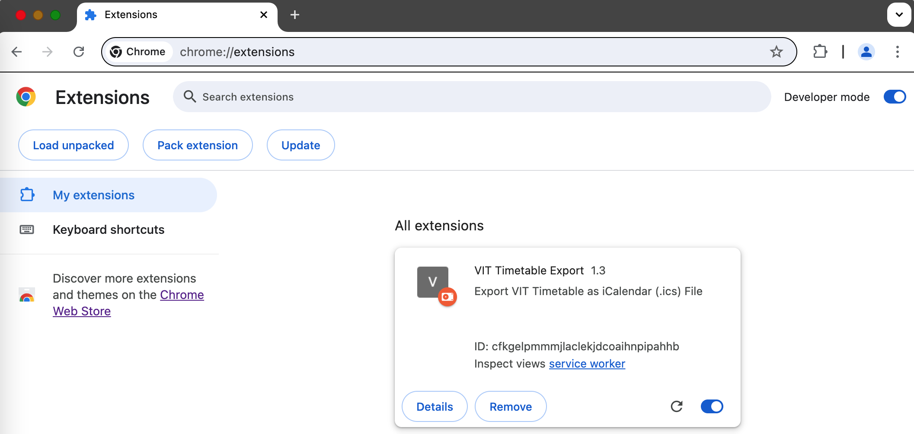
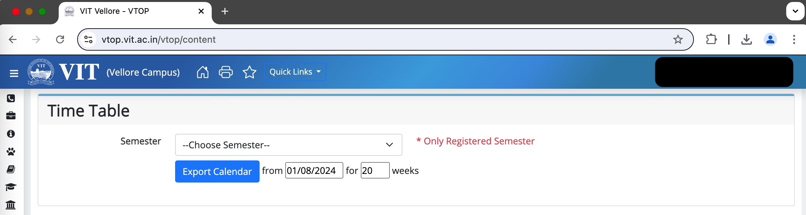
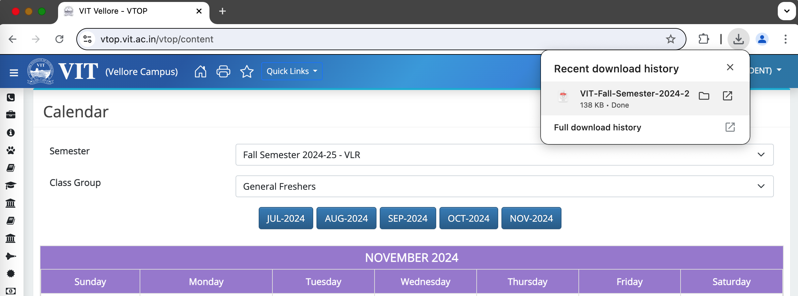
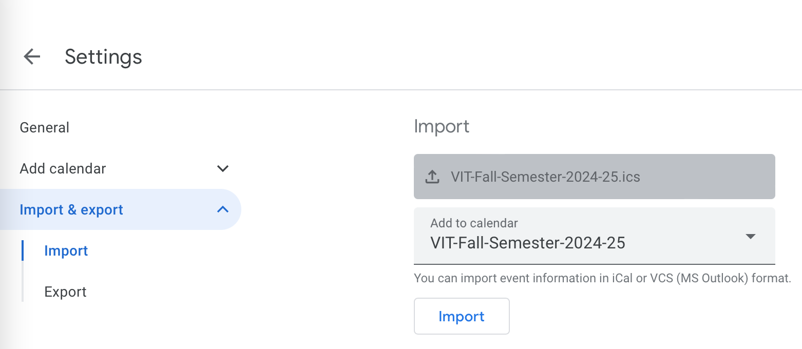
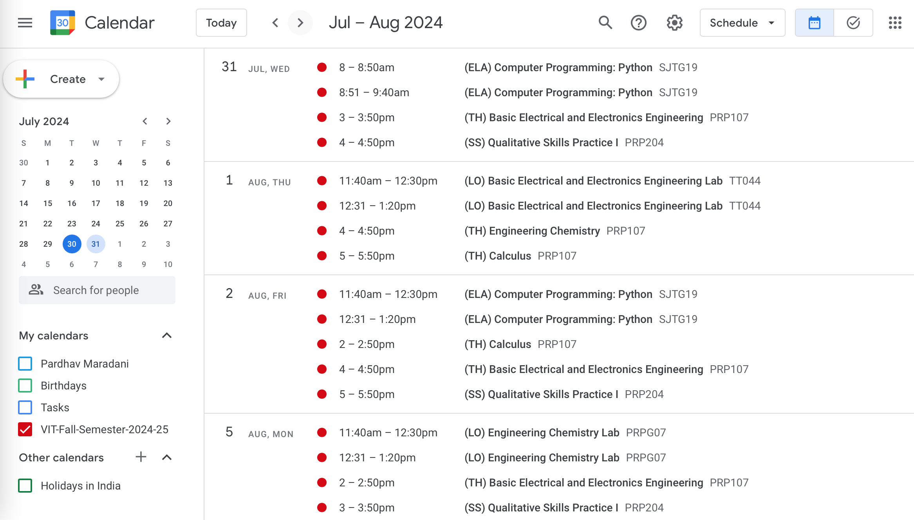
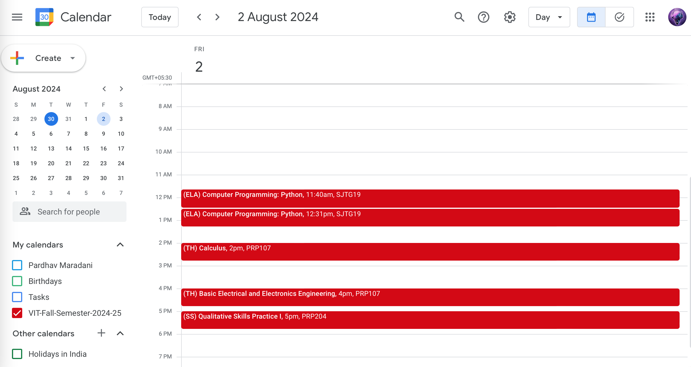
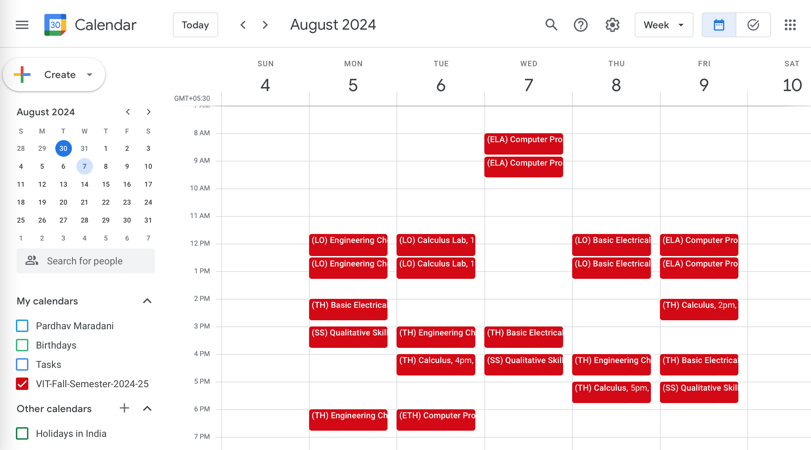
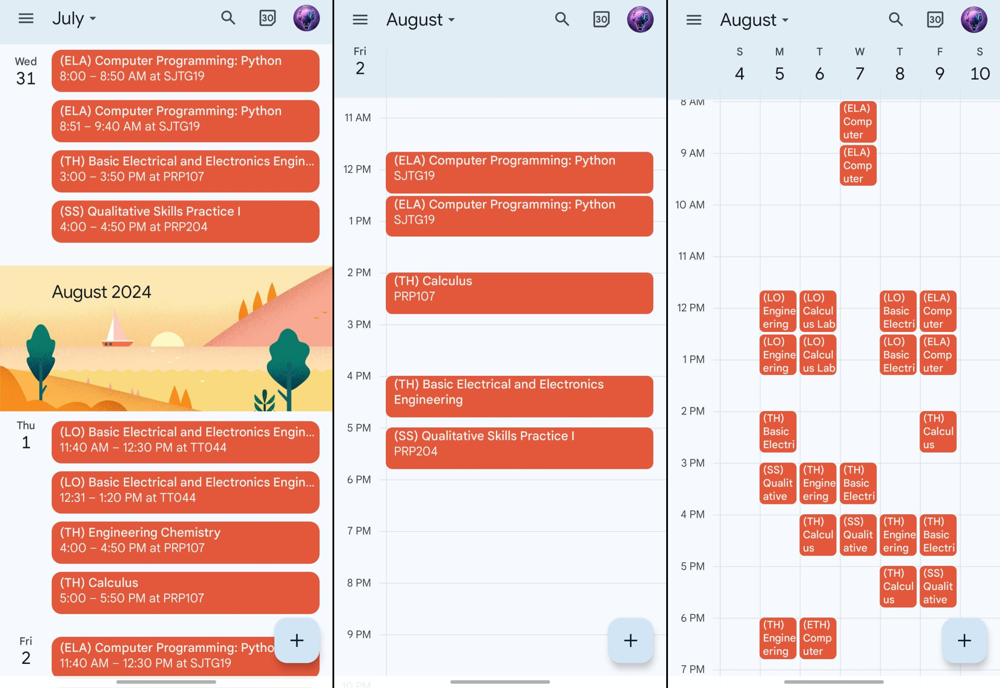
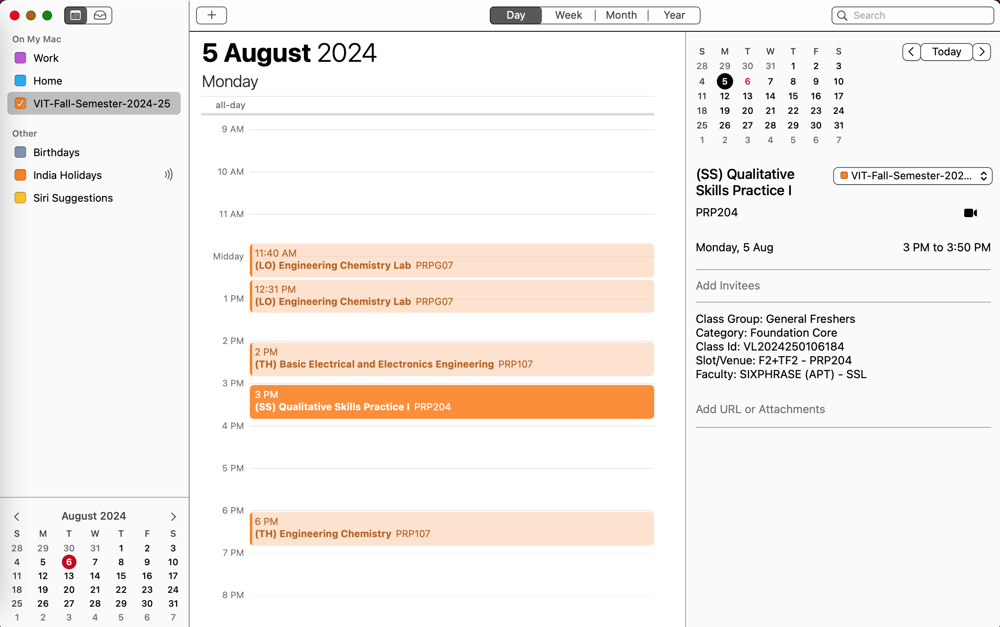
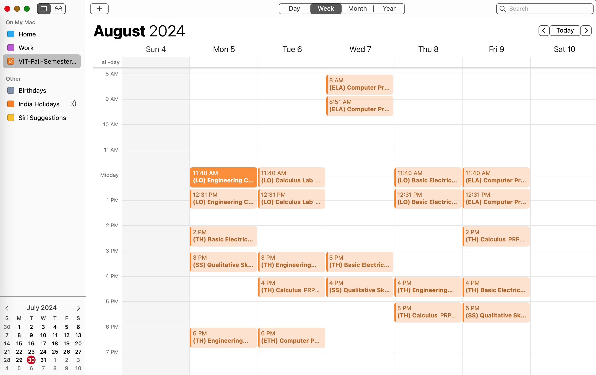

# VIT Timetable Export Plugin

This is a **Chrome Browser Extesion** that allows exporting a VIT Timetable as an `iCalendar` (`.ics`) file.

The exported `.ics` file can be imported into Google Calendar or any other Calendar application.

- [Installation](#installation)
- [Usage](#usage)
- [Import ICS into Google Calendar](#import-ics-into-google-calendar)
- [Import ICS into other calendars](#import-ics-into-other-calendars)
- [How it works](#how-it-works)

## Installation

- Clone this repository or download the ZIP and unzip
- Open Chrome extenions page by typing `chrome://extensions/`
- Enable `Developer mode` on the top right
- Click on `Load unpacked` button and select the `vit-timetable-export-plugin` folder where you cloned or unzipped this repository

You should see something like this after the above steps:

> 

## Usage

- Login to VTOP and navigate to the Timetable page
  - Under `Academics > Time table`
- With the plugin installed, you should see something like this (with an `Export Calendar` button):

> 

- Select the relevant semester and click on the `Export Calendar` button
  - Select a different starting date if needed - events will start from the Monday of that week
  - By default, recurring events for 18 weeks are created. This can be changed in the input box.
- The `.ics` file will be exported as shown below:
  - The filename will be `VIT-<semester-info>.ics`

> 

## Import ICS into Google Calendar

To import into Google Calendar

- Click on the `+` sign next to `Other calendars` in the left pane and select `Create new calendar`
  - A new calendar will make it easy to manage (like toggling on/off, changing colors, delete, etc) and is strongly recommended rather than importing into any existing calendar
- Give a name to your calendar and click on `Create calendar`
- Click on the `Import & Export` option in the left pane
- Select the newly created calendar in the `Add to calendar` dropdown
- Browse to the exported `.ics` file and click on the `Import` button

> 

- You should see a popup showing the number of events imported
- More details about importing events to Google Calendar can be found [here](https://support.google.com/calendar/answer/37118)
- Here is how the schedule, day and week views should look like:

> 

> 

> 

- Here are similar views on a mobile:

> 

## Import ICS into other calendars

- ICS is a universal calendar file format and `.ics` files can be imported into any Calendar application
- On macOS, an `.ics` file will open in the native `Calendar` app by default.  In the `Adding a new event` popup, choose `New Calendar` from the drop down menu and click on `OK` to import the calendar

> 

> 

## How it works

All of VTOP's content is dynamically generated.  There is a single URL `https://vtop.vit.ac.in/vtop/content` under which all content resides and the browser does not navigate to different pages for different sections.  The code to export the Timetable data needs to run on the `Time Table` page.  There are a few ways to achieve this, all of which require code to be injected as [Content Scripts](https://developer.chrome.com/docs/extensions/develop/concepts/content-scripts#capabilities) and run:

- Register a [context menu](https://developer.chrome.com/docs/extensions/reference/api/contextMenus) item like `Export Timetable` (right-click option) for the main content page, which when clicked in the `Time Table` page, injects and runs the export code
  - An outline of the method can be seen in the [context-menu-example](context-menu-example) folder (maybe add as backup in future)
- Clicking on the extension icon or some action after that when on the `Time Table` page (needs the extension to be pinned, etc)
- Observe the main content page to see if the `Time Table` content is loaded and then inject and run the export code.  This is the approach chosen here as it is slightly more user-friendly (though less robust than above for any future page changes)
  - The [MutationObserver](https://developer.mozilla.org/en-US/docs/Web/API/MutationObserver) API provides the ability to watch for changes being made to the DOM tree
  - `b5-pagewrapper` is the div under which most of the core page content resides (`b5pwO` is the observer object and `b5pwCb` is the callback when changes are observed)
  - This div doesn't show up right after login, which is why the `page_outline` div needs to be observed till the `b5-pagewrapper` is found (`poO` is the observer object and `poCb` is the callback).  This observer is stopped as soon as `b5-pagewrapper` is found
  - The `studentTimeTable` form in `b5-pagewrapper` indicates that the `Time Table` section is loaded and the HTML to show the export button and the input for the number of recurring weeks (`iHtml`) is injected at the end of the form
  - The click handler for the export button `exportCalendar` runs the code to parse the tables, generate the ICS text content and export the file
    - The first table is parsed only for the course ID to name mapping (`parseCourseNames`) so that the full course name is used in the calendar event
    - The second table provides the start and end times for all the theory and lab slots (first four rows) and the schedule for all the days of the week.  The first column has rows that span two column widths each and hence the column counts are adjusted accordingly depending on the row. `parseTT` parses this table and generates events from the beginning of the week (Monday) when the export is run
    - The ICS format follows a sample exported from Google Calendar which has recurring weekly events and passes the iCalendar [validator](https://icalendar.org/validator.html) for standalone use or for importing events from it.  The file is exported as `VIT-<semester-info>.ics`

> Note: Parsing raw data from HTML tables is always error-prone and is bound to break with any underlying page changes in the future.
