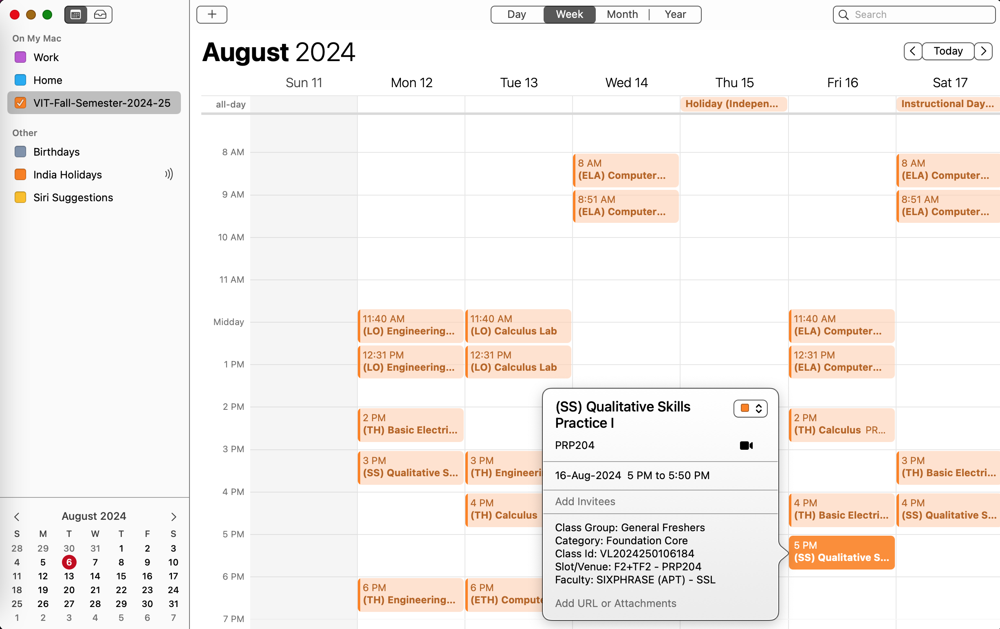

# VIT Timetable Export Plugin

This is a **Chrome Browser Extension** that allows exporting a VIT Timetable with a single click as an `iCalendar` (`.ics`) file.

All the events are created as per the Academic Calendar for a given Semester, which includes extra instructional days (with specified day order), holidays and exam dates.  Additional standalone `.ics` files can also be exported for **'Exam Schedules'** and **'Assignment Upload Schedules'**.

The exported `.ics` files can be imported into Google Calendar or any other Calendar application.

- [Installation](#installation)
- [Usage](#usage)
- [Import ICS into Google Calendar](#import-ics-into-google-calendar)
- [Import ICS into other calendars](#import-ics-into-other-calendars)
- [How it works](#how-it-works)

## Installation

- Clone this repository or download the [zip](https://github.com/PardhavMaradani/vit-timetable-export-plugin/releases/latest) and unzip
- Open Chrome extenions page by typing `chrome://extensions/`
- Enable `Developer mode` on the top right
- Click on `Load unpacked` button and select the `vit-timetable-export-plugin` folder where you cloned or unzipped this repository

You should see something like this after the above steps:

> 

## Usage

With this plugin installed, `.ics` files can be exported from the following pages in VTOP:

- [Timetable page](#timetable-page)
  - `Academics > Time Table`
- [Assignment Upload page](#assignment-upload-page)
  - `Academics > Digital Assignment Upload`
- [Exam Schedule page](#exam-schedule-page)
  - `Examination > Exam Schedule`

### Timetable page

- Go to the **'Timetable'** page under `Academics > Time Table`
- Select the semester
- `Right Click > Export ICS File`
  - The page will automatically navigate to the **'Academics Calendar'** page, populate the correct Semester, Class Group and iterate through all the months to generate the `.ics` file
- The `.ics` will be exported as `VIT-<semester-info>.ics`

Here is the whole process in action:

> 

### Assignment Upload page

- Go to the **'Assignment Upload'** page under `Academics > Digital Assignment Upload`
- Select the semester
- `Right Click > Export ICS File`
  - The page will automatically navigate to all the course dashboards, parse the assignments, returns to this page to generate the `.ics` file
- The `.ics` will be exported as `VIT-Assignment-Upload-Schedule-<semester-info>.ics`

Here is the whole process in action:

> 

### Exam Schedule page

- Go to the **'Exam Schedule'** page under `Examination > Exam Schedule`
- Select the semester and click on `Search`
- `Right Click > Export ICS File`
- The `.ics` will be exported as `VIT-Exam-Schedule-<semester-info>.ics`

Here is the whole process in action:

> 

## Import ICS into Google Calendar

To import into Google Calendar

- Click on the `+` sign next to `Other calendars` in the left pane and select `Create new calendar`
  - A new calendar will make it easy to manage (like toggling on/off, changing colors, delete, etc) and is strongly recommended rather than importing into any existing calendar
  - Standalone events from `Exam Schedule` and `Assignment Upload Schedule` `.ics` files could however be imported into existing calendars if needed
- Give a name to your calendar and click on `Create calendar`
- Click on the `Import & Export` option in the left pane
- Select the newly created calendar in the `Add to calendar` dropdown
- Browse to the exported `.ics` file and click on the `Import` button

> 

- You should see a popup showing the number of events imported
- More details about importing events to Google Calendar can be found [here](https://support.google.com/calendar/answer/37118)
- Here is how the schedule, day and week views should look like:

> 

> 

> 

- Here are similar views on a mobile:

> 

## Import ICS into other calendars

- ICS is a universal calendar file format and `.ics` files can be imported into any Calendar application
- On macOS, an `.ics` file will open in the native `Calendar` app by default.  In the `Adding a new event` popup, choose `New Calendar` from the drop down menu and click on `OK` to import the calendar

> 

> 

## How it works

All of VTOP's content is dynamically generated.  There is a single URL `https://vtop.vit.ac.in/vtop/content` under which all content resides and the browser does not navigate to different pages for different sections.  To export content in different tables as `.ics` files, code needs to be injected and run as [Content Scripts](https://developer.chrome.com/docs/extensions/develop/concepts/content-scripts#capabilities).  Until [v1.2](https://github.com/PardhavMaradani/vit-timetable-export-plugin/tree/v1.2), the [MutationObserver](https://developer.mozilla.org/en-US/docs/Web/API/MutationObserver) API was used to observe for changes in relevant divs to detect the page and add UI elements for export.  [v1.3](https://github.com/PardhavMaradani/vit-timetable-export-plugin) and above registers a more generic and extensible [Context Menu](https://developer.chrome.com/docs/extensions/reference/api/contextMenus) item `Export ICS File` (right-click option) for the main content page, which when clicked on the relevant pages carries out the export.

Export of `.ics` files is currently supported for the following pages:

- Timetable page
  - `Academics > Time Table`
- Assignment Upload page
  - `Academics > Digital Assignment Upload`
- Exam Schedule page
  - `Examination > Exam Schedule`

In the **'Timetable page'**, when the export menu item is clicked, the course and time table details on that page are parsed and then the page automatically navigates to the **'Academics Calendar'** page, populates the correct Semester, Class Group and iterates through all the months of that semester to generate the `.ics` file.

Navigation to the **'Academics Calendar'** page is through the click of the following anchor tag:

```
<a data-url='academics/common/CalendarPreview' ... href='javascript:void(0);'>
```

Clicking on this link programatically in the 'Content Script' performs the navigation, but also throws an error:

```
document.querySelector('a[data-url="academics/common/CalendarPreview"]').click();
```

```
Refused to run the JavaScript URL because it violates the following Content Security Policy directive: ...
```

This turns out to be due to the inline href code in the anchor tag, which is doing nothing here, but still causes a problem.  Apparently, this is not a problem for other tags like `span`, `button`, etc.  Only the workaround suggested [here](https://www.youtube.com/watch?v=HVugG0psJkM) resolved the problem.  In addition to being able to navigate to a different section, we also need to know when that navigation is complete and the page is ready so that we can perform the next action.  Since the dynamic requests here are all `ajax` requests, the above hack was combined with the `ajaxStop` method described [here](https://stackoverflow.com/questions/3709597/wait-until-all-jquery-ajax-requests-are-done) as follows:

```
const clickAndCallback = `
    $(document).ajaxStop(function () {
        $(this).unbind('ajaxStop');
        window.dispatchEvent(new CustomEvent('reset'));
    });
    this.click();
    this.removeAttribute('onreset');
`;
function callbackFunction() {
    // called after the element is clicked
    // and the corresponding ajax request is completed
    ...
}
window.onreset = callbackFunction;
element.setAttribute('onreset', clickAndCallback);
element.dispatchEvent(new CustomEvent('reset'));
```

The [Content Scripts](https://developer.chrome.com/docs/extensions/develop/concepts/content-scripts#capabilities) documentation suggests that communication with the embedding page be through the shared DOM and message passing.  The above code seems to achieve the same as it does the following:

- Registers a callback function on the window's `reset` event
- Sets the `onreset` attribute of the element with code that can execute in the embedding page
  - The code registers for `ajaxStop`, which gets called when all `ajax` requests are completed and dispatches the `reset` event on the main window, which calls the main window's `onreset` event handler, which is the callback function configured
  - The code also performs the click of that element and removes the `onreset` atttribute that was temporarily added
- Dispatches the `reset` event on the element that triggers the click and the eventual callback when all `ajax` requests are completed

This same method is used to populate the relevant 'Semsester', wait for the `ajax` request to complete, populate the 'Class Group', wait for that `ajax` request to complete, click through each of the months of the academic calendar and parsing the displayed calendar table after each request is complete untill all academic calendar months are parsed to put together the final `.ics` file.

The same approach outlined above is followed in the **'Assignment Upload'** page, where each of the course dashboards have to be clicked through to display and then parse the assignment schedules.

The **'Exam Schedule'** page has no such navigation and is a direct parsing of a single displayed table.

> Note: Parsing raw data from HTML tables is always error-prone and is bound to break with any underlying page changes in the future.
